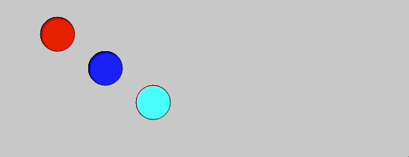

# Motion in p5

Today we are going to learn how to create animations in p5.js! Up to this point, besides when we using `random()`, we haven't been able to create motion on our screen. Today we are going to fix that!

## Tasks
1. **CHALLENGE 1**: Create 3 shapes and have them move from left to right across the screen. The shapes should have ***different*** speeds.

2. Create 3 shapes and have them move from RIGHT to LEFT across the screen. The shapes should have different speeds.

3. Create a shape that continuously moves across the screen. When the object reaches the other side of the screen, have it reappear on the left side of the screen.

4. Have a shape move from the top of the screen to the bottom of the screen. **REMEMBER**: The down direction is POSITIVE

5. Create a bouncing bubble. The circle should bounce back and forth between the two edges of the canvas
**BONUS**: Have it change speed every time it hits the edge of the canvas.

6. Create code that has your circle move back and forth from the upper left corner to the lower right corner.

